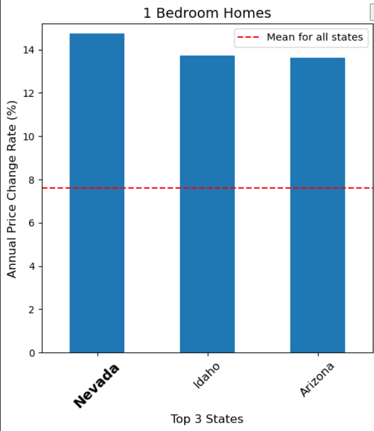
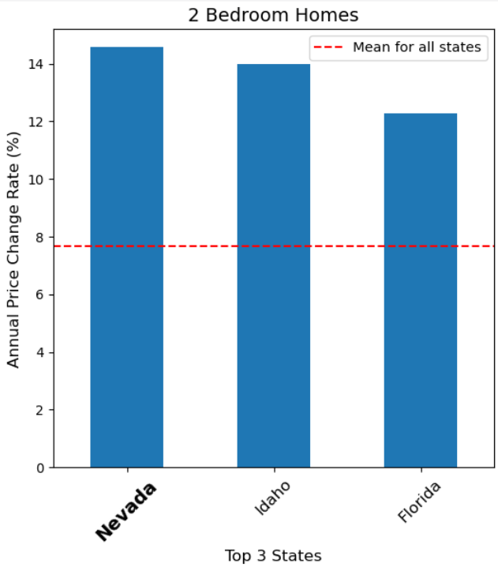
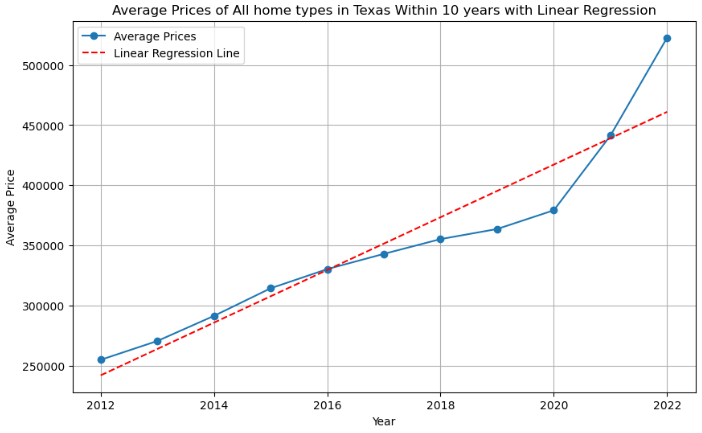
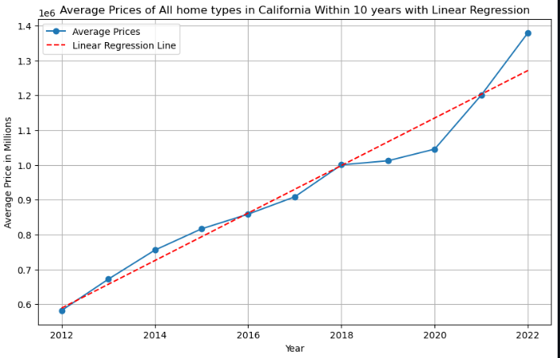
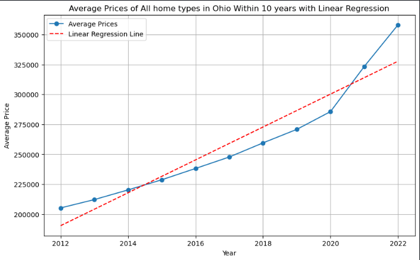
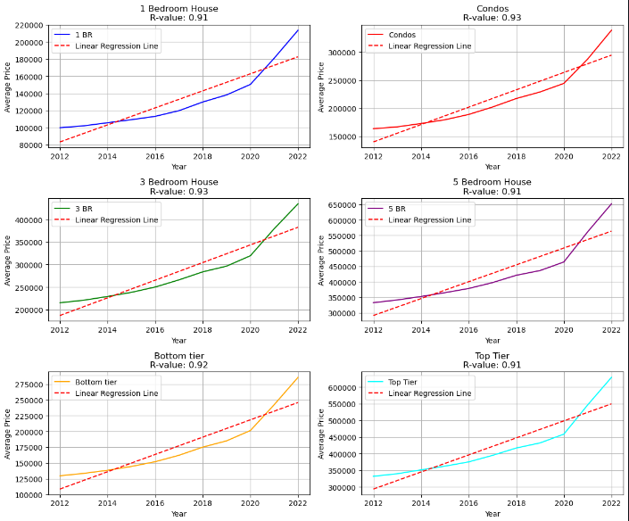
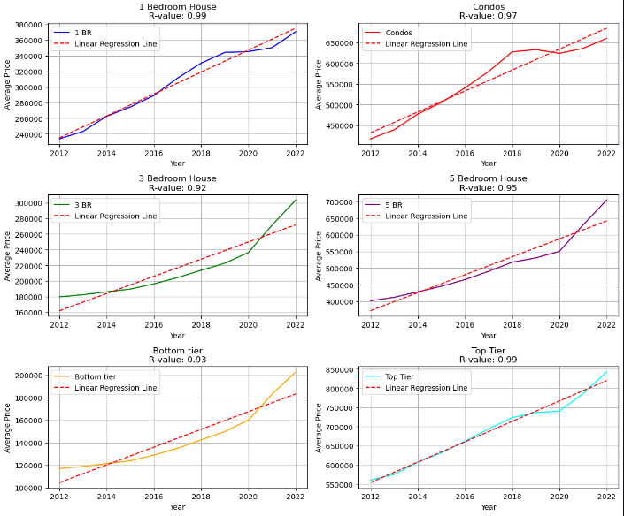

# Project1Group10

## Introduction
Our organization (G10 Consultant Group) is a data analytics and consulting group that specializes in market trend analysis across the real estate, technology, and entertainment sectors. 


## Run Locally

Clone the project

```bash
  git clone git@github.com:Arnawutu/Project1Group10.git
```

Go to the project directory

```bash
  cd Project1Group10
```

Install dependencies

```bash
  pip Install pandas
```
```bash
  pip Install requests
```
```bash
  pip Install scipy
```
```bash
  pip install matplotlib

```
Get the API key

- Create Nasdaq profile to get the api key.
- Paste api key in config.py 
- Run the .ipynb file using Jupyter Notebook.


## Description
  - This is an exploratory data analysis project with the goal of constructing a diversified investment strategy in the USA’s housing market.
  
  Components
1)	National trend analysis
  -  The goal is to discover which states and property types have seen the most growth in the USA over the past decade.

   

   

2)	Main shipping industry analysis
  - The goal is to compare the performance properties of the four main coastal states (California, Texas, Illinois, Ohio) in the USA over the past decade.


   

   

   

3)	Safe state analysis
  - The goal is to compare the pricing performance of two of the safest states (New Hampshire, Maine) in the USA over the past decade. 

#### New Hampshire properties

   

#### Maine properties

   

## Table of Contents
  Main_Data Folder
  -	Data_Cleaning-Final: the complete code used for the analysis
  -	Nasdaq Real Estate Data Cleaning.pptx: The power point for the presentation
  -	Final_Report_USAHousingMarket: The final report discussing our findings
    
  Resources Folder
  - Zillow_Regions: the csv file for the region data
  - Zillow_Data: the csv file for the home values (has to be manually added)
  -	bystate: the merged csv file, pre cleaning 
  
## Credits
-	The Zillow Real Estate Data: https://data.nasdaq.com/databases/ZILLOW/documentation?anchor=publisher
